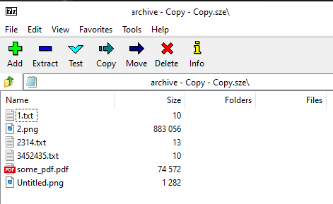

# Implementation of the SZE archive

## Format of the SZE archive

```bnf
<archive> :== <single_file> | <single_file> <file_content> 
<single_file> :== "{"<filename>|<size>"}"<file_content>
<filename> :== <file_name>"."<file_extension>
<size> :== number of bytes in <file_content>
<file_content> :== series of bytes representing file
```

Not all methods are discussed here. See [sze-archive.cc](https://github.com/ikremniou/7z-assembly/blob/master/src/archive/sze-archive.cc) for the full implementation.

The SZE archive emulates the real archive format. It is not readonly and user can add files to it. If user adds file with invalid symbols we should show error. As usual, lets start with the definitions of the classes required to implement the SZE archive.

<<< ../src/archive/sze-archive.h#snippet{C++}

Archive format implements the both [IInArchive](./plugin-api-inarc.md) and [IOutArchive](./plugin-api-outarc.md) interfaces. We use `items_` to store files of the archive in memory. We do not resist the file stream and dispose in after we read all files in memory.

## [IInArchive::Open](./plugin-api-inarc.md#open)

<<< ../src/archive/sze-archive.cc#open{C++}

This code is responsible for parsing archive [format](#format-of-the-sze-archive) and validating its signature. 

## [IInArchive::Extract](./plugin-api-inarc.md#extract)

<<< ../src/archive/sze-archive.cc#extract{C++}

It looks similar to the implementation of the SZ archive, except `items_` is used to extract files.

## [IOutArchive::UpdateItems](./plugin-api-outarc.md#updateitems)

<<< ../src/archive/sze-archive.cc#update{C++}

Implementation splits into 2 steps:
1. Updating the `items_` array in memory. We should cover 3 cases:
    - item(s) added;
    - item(s) removed;
    - item(s) renamed;
2. Writing the `items_` array to the output steam

### UpdateItemsInMemItems

<<< ../src/archive/sze-archive.cc#update_items_in_mem{C++}

This code updates `items_` collection by creating a new vector `new_items` of items and then swapping it with `items_` at the end.

### WriteFilesToOutStream

<<< ../src/archive/sze-archive.cc#write_files_to_out_stream{C++}

This code serializes in-mem `items_` back to the output stream.

## [IInArchive::GetPropertyInfo](./plugin-api-inarc.md#getpropertyinfo)

<<< ../src/archive/sze-archive.cc#get_property_info{C++}

It is optional method to implement. I just added this sample to show how to display properties. As result, we can see "Size" as new column in 7z File Manager.

At the end archive will look like this:

<div align="center">


</div>
